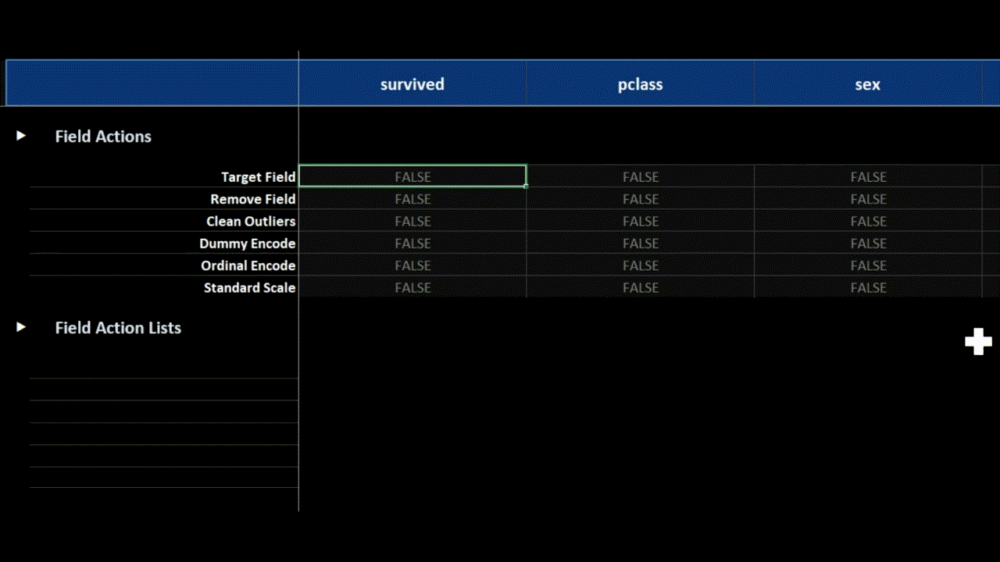
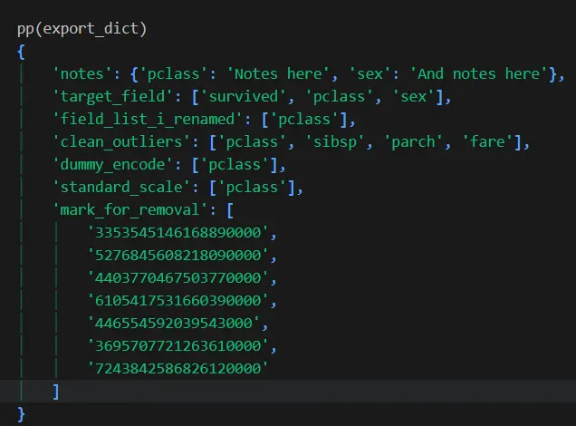

# **xleda is a Microsoft Excel powered EDA tool for Python data.**

* Easily produces a Microsoft Excel workbook from a pandas dataframe that is highly optimized to both perform and document [the activity of Exploratory Data Analysis](https://www.geeksforgeeks.org/data-analysis/what-is-exploratory-data-analysis/) .

* Microsoft Excel is great for EDA:

	* Visually explore your data, navigate with your keyboard, take notes, mark fields/records for editing, share your workbook with other contributors.

* See [some example xleda workbooks](examples).


<center>
	<figure> 
		 
		<figcaption>An xleda workbook made with with Titanic passenger data.</figcaption> 
	</figure>
</center>

# **xleda is Not a Data Transformation Tool**

* This will not edit your data.  

* It will help you quickly get your data into Excel so that you can understand and document it.

# **Quick Start**

```python
import seaborn as sns
from xleda import FieldAnalysis
  

# < Insert your data here >
df = sns.load_dataset("titanic")  

# Configures an xleda workbook
xleda_wb = FieldAnalysis(input_df=df,
                         name="Titanic",
                         theme_color="#053476",
                         overwrite=True)

# Creates the workbook
xleda_wb.create_workbook()
  

# Imports your analysis back into python
export_dict = xleda_wb.export_analysis()

```


# **Usage Notes**

## **Included Metadata**

* Most of the included field metadata is from the built-in pandas features [describe](https://pandas.pydata.org/docs/reference/api/pandas.DataFrame.describe.html), [info](https://pandas.pydata.org/docs/reference/api/pandas.DataFrame.info.html), and **[quantile](https://pandas.pydata.org/docs/reference/api/pandas.DataFrame.quantile.html)**. 

## **Theme Color**

* `theme_color` sets the primary color of the charts and the color of the headings in the workbook.  

* Because this tool creates workbooks in dark mode, choose a dark color though any hex color will technically work.

## **Field/Record Lists**

* The `Field Actions` section is really a way to easily create lists of the fields/records in your data.  The action part is something you're responsible for. 

	* Anything not marked as `False` will be included in each list.   

	* The `Mark For Removal` field added to your source data works the same way except it creates a list of records instead of a list of fields.  More on that field [below](#record-list-details)

	* You can rename `Mark For Removal` or any `Field Action` to `Anything You Want` and the list will be renamed to `anything_you_want`.

	* You can see your lists in the `Field Actions Lists` section or you can [use `export_analysis()`](#export-analysis) to get them into python.

<center>
	<figure> 
		 
		<figcaption>Field actions as lists.</figcaption> 
	</figure>
</center>


## **Requirements/Compatibility**

* Requires Microsoft Excel.  Should work for most MS Office SKUs.

* This is powered by the amazing duo of [pandas](https://pandas.pydata.org/) and [xlwings](https://www.xlwings.org/).  It should work on MacOS and Windows though it has only been tested so far on Windows. 

* There is a small amount of VBA code in the template that isn't actually required.  It makes the sections expand/collapse when you select them, similar to web-based tools.  Use row groupings as pictured below if you can't or don't want to enable VBA. 

<center>
	<figure> 
		 
		<figcaption>Use row groupings to navigate if you can't use VBA.</figcaption> 
	</figure>
</center>


## **Record List Details**

* Although your data isn't edited by this tool, there are two additional columns added to support being able to create a list of records for further processing.

	* `Record Hash`:  Uses a built-in pandas feature [hash_pandas_object](https://pandas.pydata.org/docs/reference/api/pandas.util.hash_pandas_object.html) to uniquely identify records.  If two records share all column values they also share a Record Hash. 

	* `Mark For Removal`:  Used to create a list of `Record Hash` values.

## **Export Analysis**


*  Use `xleda_wb.export_analysis()` to export your notes and lists into python. 

* `xleda_wb.source_df` is your source data with the added `Record Hash`/`Mark for Removal` columns.  No other changes were made.

* If you wish to hard-code your down-stream edits, copy/pasting your lists may work better for you which is why they're formatted as python lists in the workbook.

<center>
	<figure> 
		 
		<figcaption>An example export dictionary.</figcaption> 
	</figure>
</center>


## **Limits with Large Data Sets**

* This creates EDA workbooks for most data sets in 10-20 seconds.

* To ensure that they are created quickly, defaults limit data to the first 100 columns and a random sample of 100,000 records.  You'll see a warning if you hit a limit.

* `large_report=True` raises the limits to Excel's limits of 1,000,000 rows and 16,000 columns.  The closer your are to this limit, the longer it will take to produce. 

* This was tested with a lot of different datasets on an average machine.  One of the largest tested was a 600 column/1,200 row df that took ~12 minutes to create but is still snappy to use even though it has 1,200 charts on a single worksheet.  That example is [here](examples/African%20Soil.xlsm).

