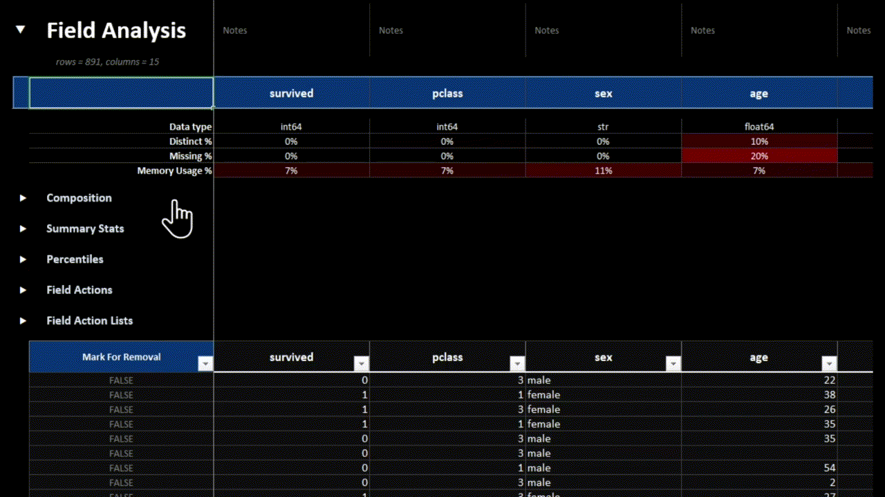
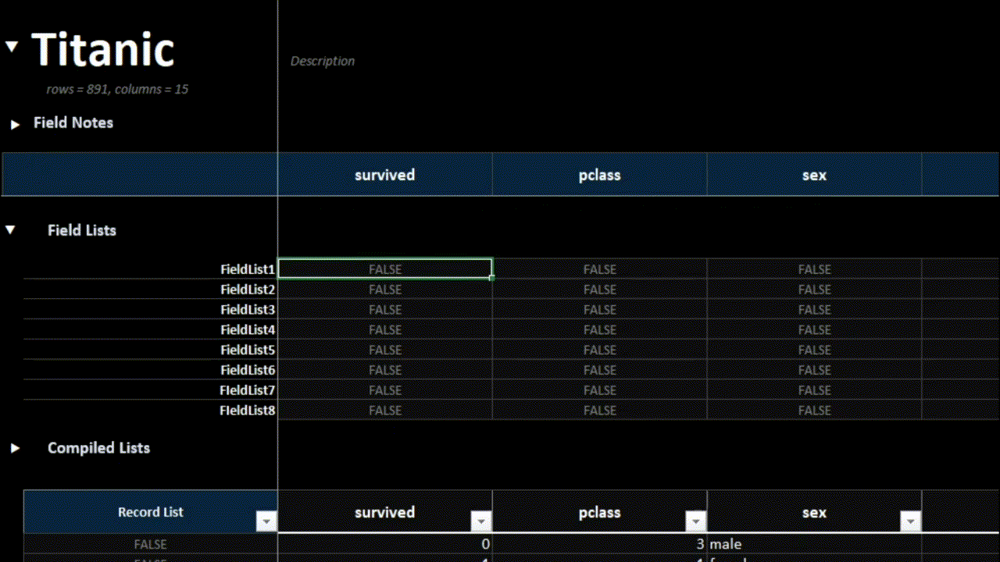
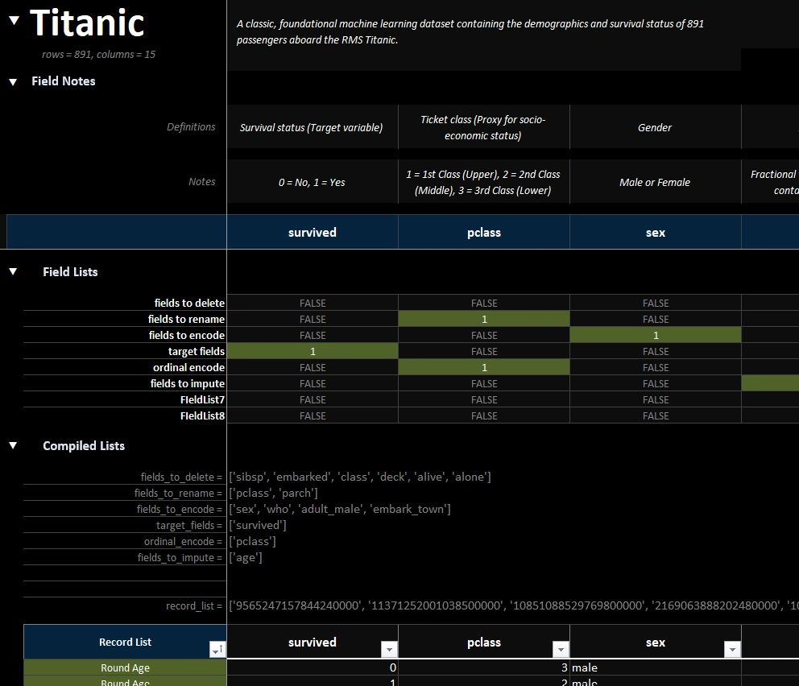
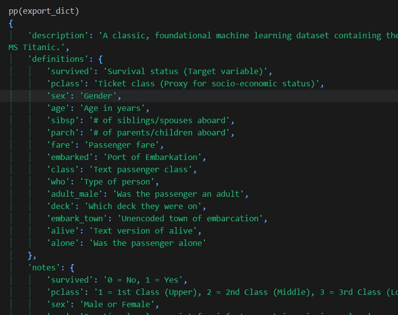
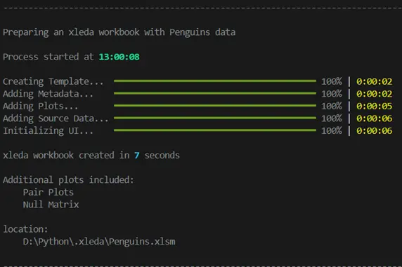
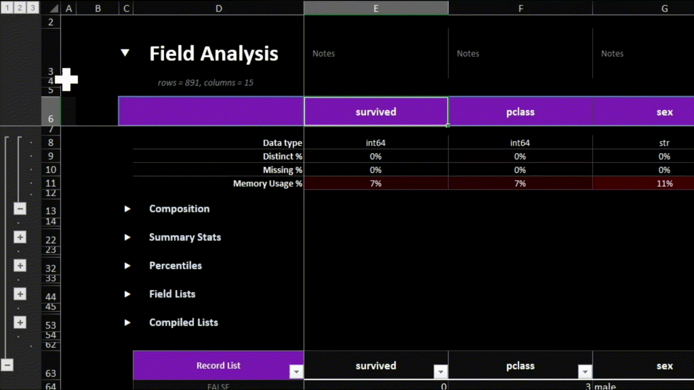

# **xleda is a Microsoft Excel powered EDA tool for Python data.**

* Produces a Microsoft Excel workbook from a pandas dataframe that is highly optimized to both perform and document [the activity of Exploratory Data Analysis](https://www.geeksforgeeks.org/data-analysis/what-is-exploratory-data-analysis/) .

* There are some amazing EDA tools for Python.  You shouldn't have to start from scratch to include Microsoft Excel among them.

* Visually explore your data, navigate with your keyboard, take field/record notes, create lists of fields/records for editing, round-trip your edits/analysis back into python, share your workbook with other contributors.

* See [some example xleda workbooks](examples).

<center>
	<figure> 
		 
		<figcaption>An xleda workbook made with Titanic passenger data.</figcaption> 
	</figure>
</center>


# **Requirements/Compatibility**

* Requires Microsoft Excel to create the workbook. 

* It has been tested on Windows though it should also work on MacOS.  

* xleda workbooks should work in anything that reads Microsoft Excel workbooks.


# **Quick Start**

```python
import seaborn as sns
from xleda import FieldAnalysis
  

# < Insert your data here >
df = sns.load_dataset("titanic")  

# Configures an xleda workbook
xleda = FieldAnalysis(input_df=df,
                      name="Titanic",
                      theme_color="#053476",
                      overwrite=True)

# Creates the workbook
wb = xleda.create_workbook()
  

# Imports your data/analysis back into Python
export_dict = xleda.export_analysis()

```


# **Usage Notes**

## **Included Metadata**

* Most of the included field metadata is from the built-in pandas features [describe](https://pandas.pydata.org/docs/reference/api/pandas.DataFrame.describe.html), [info](https://pandas.pydata.org/docs/reference/api/pandas.DataFrame.info.html), and **[quantile](https://pandas.pydata.org/docs/reference/api/pandas.DataFrame.quantile.html)**. 

## **Theme Color**

* `theme_color` sets the primary color of the charts and the color of the headings in the workbook to a hex color of your choice.  
  
## **Field/Record Lists**


<center>
	<figure> 
		 
		<figcaption>Easily create lists of fields in your data.</figcaption> 
	</figure>
</center>

* The `Field Lists` section helps you create lists of the fields in your data.  

	* Anything not marked as `False` will be included in each list.   

	* The `Record List` field added to your source data works the same way except it creates a list of records instead of a list of fields.  More on that [below](#**Record%20List%20Details**)

	* You can see your lists in the `Compiled Lists` section.  

	* You can rename `Record List` or any `Field List` to `Anything You Want` and the list will be renamed to `anything_you_want`.

	* The Compiled Lists section formats your lists as python lists for easy copy/pasting.

	* You can use `export_analysis()` to get your lists, and other things, back into Python.  See details [below](##%20**Exporting%20back%20into%20Python**).

	* Altering the Field Analysis worksheet may offset the formulas which compile your lists.   Spot check them before using them if you have.

<center>
	<figure> 
		 
		<figcaption>A completed xleda workbook of Titanic passenger data.</figcaption> 
	</figure>
</center>

## **Record List Details**

* Two additional columns are added to your data to support being able to create a list of records for further processing.

	* `Record Hash`:  Uses a built-in pandas feature [hash_pandas_object](https://pandas.pydata.org/docs/reference/api/pandas.util.hash_pandas_object.html) to uniquely identify records.  If two records share all column values they also share a `Record Hash`. 

	* `Record List`:  Used to create a list of `Record Hash` values.

## **Exporting back into Python**

* `export_analysis()` exports your xleda analysis back into Python.  
 
* This function assumes you haven't altered the structure of your workbook such as adding rows/columns.  

* The dictionary includes:

	* `lists`: Any lists showing in the compiled lists section
	* `notes`: Any field notes you've added
	* `definitions`: Any field definitions you've added.
	* `source_data`: A copy of your unaltered source data that includes `Record Hash`/`Record List` columns.
	* `altered_source_data`: source data from the workbook that includes any manual edits you've made such as removing records, renaming fields, etc. 
	

	 ** *Note that data types will likely change in the round-trip translation.* **


<center>
	<figure> 
		 
		<figcaption>An example export from a completed field analysis on Titanic passenger data. 
		</figcaption> 
	</figure>
</center>


## **Limits with Large Data Sets**

* xleda creates workbooks for most data sets in 10-20 seconds.

<center>
	<figure> 
		 
		<figcaption>The Air Quality example took only 7 seconds to create. 
		</figcaption> 
	</figure>
</center>

* To ensure that they are created quickly, defaults limit data to the first 100 columns and a random sample of 100,000 records.  You'll see a warning if you hit a limit.

* `large_report=True` raises the limits to Excel's limits of 1,000,000 rows and 16,000 columns.  The closer your are to this limit, the longer it will take to produce. 

* One of the largest data sets tested was a 600 column/1,200 row dataframe.  It took ~12 minutes to create but is still snappy to use even though it has 1,200 charts on a single worksheet.  That example is [here]("examples\african_soil.xlsm").


## **Extensible**

* A convenience function, `add_plot`, is included to add additional worksheets with a plot of your choosing after creating your workbook.   The workbook from the example below can be found here. 

```python
# Style the additional plots (optional)
plt.style.use("dark_background")

# Create additional plots
pair_plots = sns.pairplot(df, hue="species").figure
null_matrix = msno.matrix(df).get_figure()
 
# Adds the additional plots to worksheets named 'title'
xleda.add_plot(title="Pair Plots", figure=pair_plots)
xleda.add_plot(title="Null Matrix", figure=null_matrix)
```

* Because it's an ordinary workbook, you can use any tool that works with Microsoft Excel workbooks to do more.  xlwings is recommended if you need more. 

## **VBA Code**

* There is a small amount of VBA code in the template that makes the sections expand/collapse when you select them as pictured above.  If you can't or don't want to enable VBA, use row groupings as pictured below. 

<center>
	<figure> 
		 
		<figcaption>Use row groupings to navigate if you can't use VBA.</figcaption> 
	</figure>
</center>

