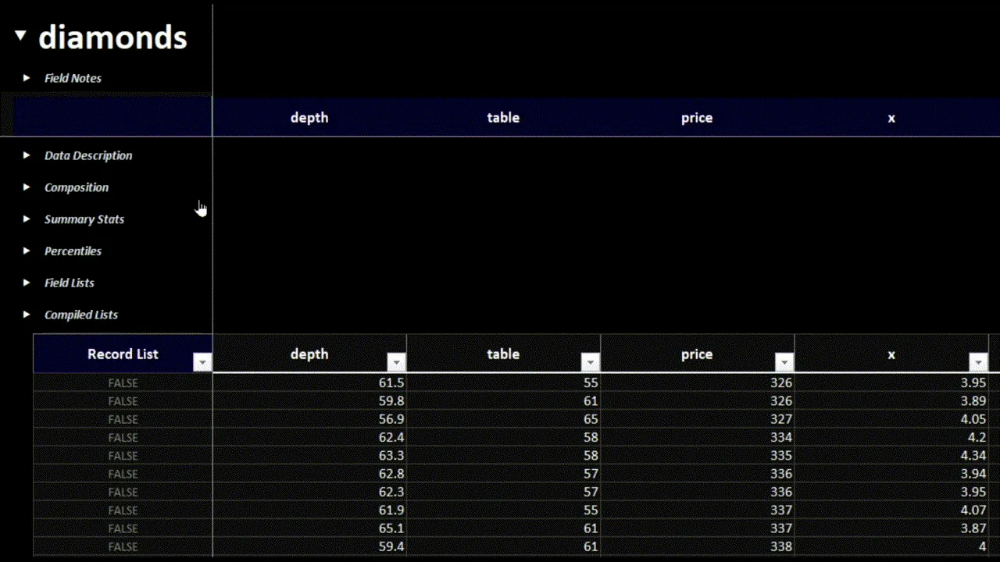
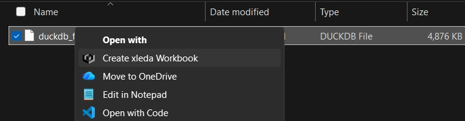
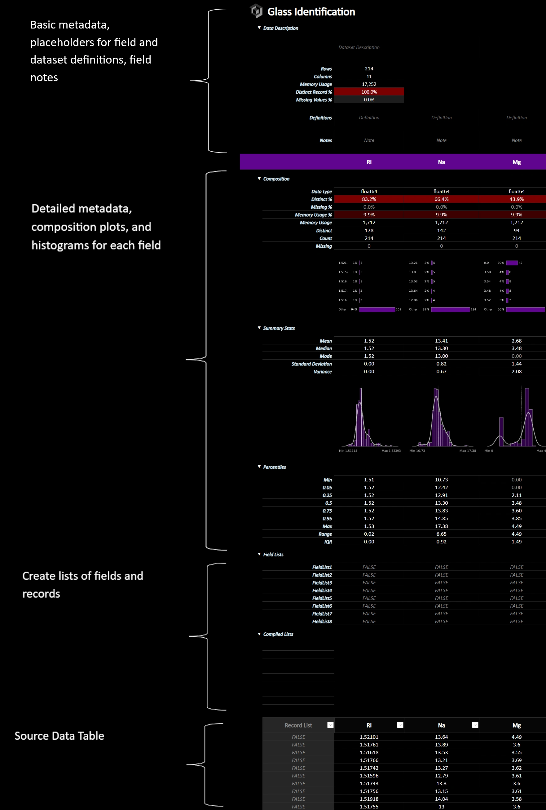
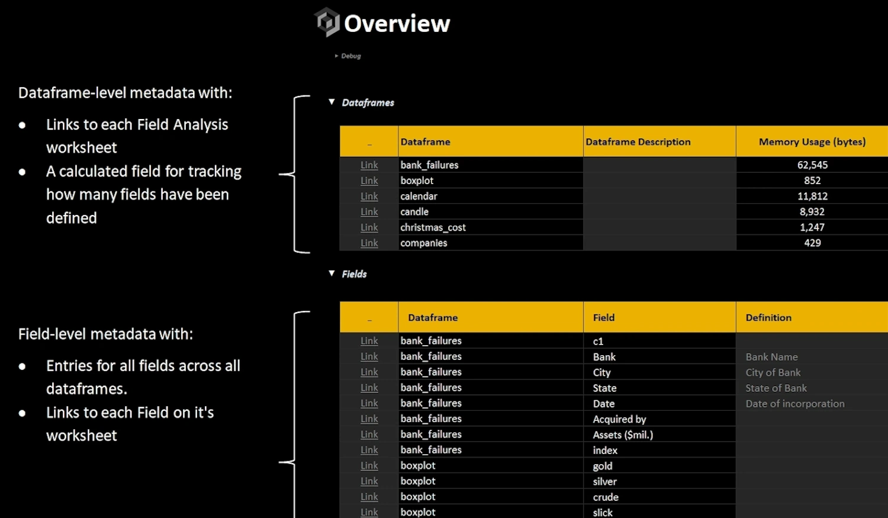
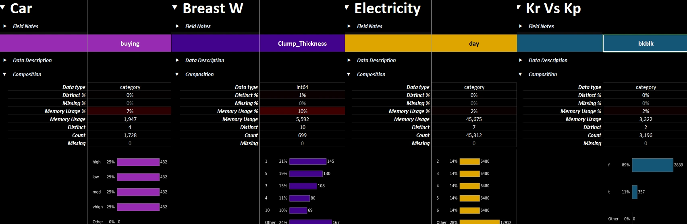
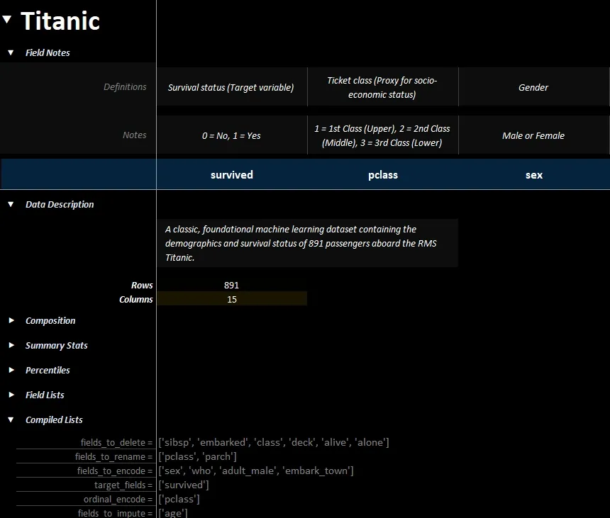
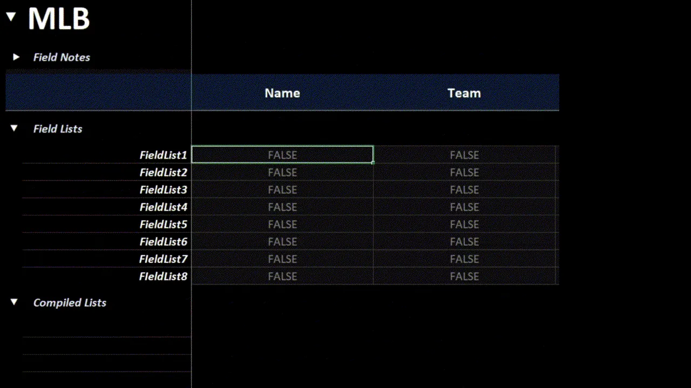
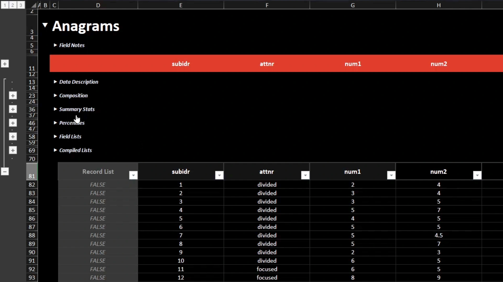

<div align="center">


<a href="https://www.apache.org/licenses/LICENSE-2.0.txt"></a> <a href="https://pypi.org/project/xleda"></a> <a href="https://pypi.org/project/xleda"></a> <a href="https://pepy.tech/project/xleda"></a> <a href="https://github.com/InfoDesigner/xleda"></a> <a href="https://buymeacoffee.com/informationdesigner"></a>


</div>

<p align="center">
	
	<br>
</p>
<p align="center" style="font-size: 26px; font-weight: bold;">Own your data by defining it</p>

<br>

* A Microsoft Excel/Python powered EDA tool that creates workbooks from dataframes or data files that are highly optimized to explore, define, and document data sets. <br><br>

* Works on both MacOS/Windows as a Python package, a CLI, or as a service that lets you create workbooks by right-clicking supported files.<br><br>

* There are some amazing EDA tools available to data professionals. You shouldn't have to start from scratch to include Microsoft Excel among them.<br><br>

* See [some example xleda workbooks](https://github.com/InfoDesigner/xleda/tree/main/examples).<br><br>
<p align="center">
	 
	<br>
	<em>Top view of a Field Analysis worksheet.</em>
</p><br>

## **Requirements/Compatibility**
<br>
<table>
  <tbody>
    <tr>
      <td width="30%" valign="top"><br><strong>Desktop Excel</strong></td>
      <td valign="top"><br>
      Requires the full version of Microsoft Excel (2016+) on either MacOS or Windows to create workbooks<br><br>
        <ul>
          <li>See MacOS Support section below for details on MacOS usage.</li><br>
        </ul>
      </td>
    </tr>
    <tr>
      <td valign="top"><br><strong>Supported Data</strong></td>
      <td valign="top"><br>
      Supports pandas dataframes, CSV, DuckDB, SQLite, Feather, Parquet, Pickle, Excel, RData, JSON, and XML<br><br>
      </td>
    </tr>
  </tbody>
</table><br>

## **Installation**

<br>
<table>
  <tbody>
    <tr>
      <td width="30%" valign="top"><br><strong>Package/CLI</strong></td>
      <td valign="top">
        <br>
        <code>uv add xleda</code> or <code>pip install xleda</code><br><br>
      </td>
    </tr>
    <tr>
      <td valign="top"><br><strong>Right-Click Menu</strong></td>
      <td valign="top"><br>
        xleda can optionally be installed into the OS such that it will create workbooks from a right-click context menu action on supported file types.
        <ul><br>
          <li>Works on both Windows and MacOS</li><br>
          <li>After installing as a package, use <code>xleda install</code> or <code>xleda uninstall</code> to add/remove right-click menus.</li><br>
        </ul>
      </td>
    </tr>
  </tbody>
</table><br>


<details markdown="1">
  <summary><strong>Tips:</strong> Managing the Install</summary>
  
- `xleda install` adds right-click functionality to your OS but it does not modify your path to make the CLI globally available.
  
- If the Python environment that xleda was installed into is deleted after running `xleda install`, the right-click functionality will need to be either repaired or uninstalled by running `xleda install/xleda uninstall` again from a new Python environment.
  
- If you have UV installed, you can install/uninstall the package, CLI, and right-click menus systemwide without having to maintain a venv with these one-liners.

**Windows PowerShell**

```bash
# Installs the package and right-click menus
uv tool install xleda; if ($?) { xleda install }

# Uninstalls the package and right-click menus
xleda uninstall; if ($?) { uv tool uninstall xleda }
```

**MacOS**

```bash
# Installs the package and right-click menus
uv tool install xleda && xleda install

# Uninstalls the package and right-click menus
xleda uninstall && uv tool uninstall xleda
```

</details><br>

## **Quick Start**

Use <code>wb()</code> to quickly create an xleda workbook from a dataframe or a supported data file.

### From a Dataframe

```python
from xleda import wb
import seaborn as sns

# < your dataframe goes here >
df = sns.load_dataset("titanic")

# Creates xleda.xlsm in the current directory
wb(df)
```

### From a File

```python
from xleda import wb
from pathlib import Path

# < your data file goes here >
duckdb_file = Path("my_fancy_db.duckdb")

# Creates my_fancy_db.xlsm in the current directory
# Includes data from all tables in the db file
wb(duckdb_file)
```

### From the CLI

```bash
# Creates 'my_parquet_file.xlsm' in the current directory
xleda wb 'my_parquet_file.parquet'
```

### From Right-Clicking

<p align="left">
  
</p><br><br>

## **xleda Components**

All xleda workbooks include an **Overview** worksheet and a **Field Analysis** worksheet for each provided dataframe.<br><br>


<br>
<table>
  <tbody>
    <tr>
      <td width="30%" valign="center"><strong>Field Analysis</strong></td>
      <td valign="center">
        <br>
        <ul>
          <details>
            <summary><strong>Anatomy of a Field Analysis Worksheet</strong>&emsp;&emsp;&emsp;&emsp;</summary>
            <br><br>
            <p align="left">
              <br>
              
              <br>
              <br><br>
              <em>Field Analysis Anatomy</em><br>
            </p>
            <br>
          </details>
          <br>
        </ul>
      </td>
    </tr>
    <tr>
      <td valign="center"><strong>Overview</strong></td>
      <td valign="center">
        <br>
        <ul>
        <details>
          <br>
          <summary><strong>Anatomy of an Overview Worksheet</strong></summary>
          <br><br>
          <p align="left">
            <br>
            
            <br>
            <em>Overview Worksheet with Multiple Dataframes</em>
          </p>
          <br>
        </details><br>
        </ul>
      </td>
    </tr>
  </tbody>
</table><br>


## **xleda.wb() Configuration**


<br>
<table>
  <tbody>
    <tr>
      <td width="30%" valign="top"><br><strong><code>data</code></strong></td>
      <td valign="top"><br>
        <strong>Dataframe or Path or string | Mandatory</strong><br><br>
        <ul>
          <li>Accepts a pandas dataframe, a dictionary of dataframes, or a supported data file</li>
          <li>For files, xleda will create a workbook from all tabular objects in the file</li>
          <li>Supported types include CSV, DuckDB, SQLite, Feather, Parquet, Pickle, Excel, RData, JSON, and XML</li><br>
        </ul>
          <details><br>
            <summary>Data File Limitations</summary>
            If the provided data file doesn't parse correctly, try creating a 
            dataframe first and use that with xleda instead of the file<br><br>
            <strong>Expect problems with</strong>:<br><br>
            <ul>
              <li>Deeply nested JSON/XML</li>
              <li>A <code>.CSV</code> file with tabs instead of commas<br>
              <li><code>.db</code> files that are neither SQLite nor DuckDB files<br>
              <li>DuckDB files with a <code>.txt</code> extension<br>
            </ul><br>
          <strong>Don't expect to see</strong>:<br><br>
            <ul>
              <li>Anything from an RData file that isn't a dataframe</li>
              <li>Dataframes that are nested somewhere inside a pickle file</li>
              <li>Anything sourced from an Excel file that isn't a proper Excel Table</li>
            </ul>
          </details><br>
        </ul>
      </td>
    </tr>
    <!-- file name -->
    <tr>
      <td width="30%" valign="top"><br><strong><code> file_name</code></strong>
      </td>
      <td valign="top"><br>
        <strong>str | Optional</strong><br><br>
        <ul>
          <li>The workbook file name to create.</li>
          <li>Defaults to the source file name, the first key in a dataframe dict, or <code>xleda</code></li><br>
        </ul>
      </td>
    </tr>
    <!-- wb path -->
    <tr>
      <td width="30%" valign="top"><br><strong><code>wb_path</code></strong>
      </td>
      <td valign="top"><br>
        <strong>Path or string | Optional</strong><br><br>
        <ul>
          <li>Use a directory or file path</li>
          <li>If a directory is provided, the workbook is created there</li>
          <li>If a filename ends with <code>.xlsm</code> or <code>.xlsx</code>, xleda will create or export from that file</li>
          <li>Defaults to the current working directory or the source file directory</li><br>
        </ul>
      </td>
    </tr>
    <!-- theme color -->
    <tr>
      <td width="30%" valign="top"><br><strong><code>theme_color</code></strong>
      </td>
      <td valign="top"><br>
        <strong>str | Optional</strong><br><br>
        <ul>
          <li>Sets the primary workbook color and chart color</li>
          <li>Supports hex colors or <code>random</code></li>
          <li>Defaults to a neutral color.</li>
        </ul>
        <p align="center"><br>
          <br>
          <em>theme_color affects the workbooks and default charts.</em><br>
        </p><br>
      </td>
    </tr>
    <!-- plots -->
    <tr>
      <td width="30%" valign="top"><br><strong><code>plots</code></strong>
      </td>
      <td valign="top"><br>
        <strong>dict | Optional</strong><br><br>
        <ul>
          <li>Adds extra plot worksheets using a dict of matplotlib Figure objects</li>
          <li>Accepts <code>{'plotname': Figure, ...}</code> format</li>
          <li>No automatic styling or sizing is applied</li><br>
        </ul>
      </td>
    </tr>
    <!-- overwrite -->
    <tr>
      <td width="30%" valign="top"><br><strong><code>overwrite</code></strong>
      </td>
      <td valign="top"><br>
        <strong>bool | Optional</strong><br><br>
        <ul>
          <li>Overwrites existing workbooks of the same name</li>
          <li>Existing files are moved to Trash/Recycle Bin</li>
          <li>Defaults to <code>False</code></li><br>
        </ul>
      </td>
    </tr>
    <!-- large_report -->
    <tr>
      <td width="30%" valign="top"><br><strong><code>large_report</code></strong>
      </td>
      <td valign="top"><br>
        <strong>bool | Optional</strong><br><br>
        <ul>
          <li>Raises limits to Excel's maximum: 1,000,000 rows and 16,000 columns</li>
          <li>Requires more memory and time for large datasets</li>
          <li>Defaults to <code>False</code></li><br>
        </ul>
      </td>
    </tr>
    <!-- no_vba -->
    <tr>
      <td width="30%" valign="top"><br><strong><code>no_vba</code></strong>
      </td>
      <td valign="top"><br>
        <strong>bool | Optional</strong><br><br>
        <ul>
          <li>Creates a <code>.xlsx</code> workbook without VBA</li>
          <li>Setting this flag persists the preference so that you can set it and forget it</li>
          <li>Use an <code>.xlsx</code> file for <code>wb_path</code> as an alternative though this won't persist</li>
          <li>Defaults to <code>False</code></li><br>
        </ul>
      </td>
    </tr>
    <!-- open_wb -->
    <tr>
      <td width="30%" valign="top"><br><strong><code>open_wb</code></strong>
      </td>
      <td valign="top"><br>
        <strong>bool | Optional</strong><br><br>
        <ul>
          <li>Opens the workbook after creation</li>
          <li>Set to False when creating multiple workbooks</li>
          <li>Defaults to <code>True</code></li><br>
        </ul>
      </td>
    </tr>
    <!-- export -->
    <tr>
      <td width="30%" valign="top"><br><strong><code>export</code></strong>
      </td>
      <td valign="top"><br>
        <strong>bool | Optional</strong><br><br>
        <ul>
          <li>Exports data from an xleda workbook instead of creating one</li>
          <li>See the Examples/Exporting Metadata sections below for details</li>
          <li>Defaults to <code>False</code></li><br>
        </ul>
      </td>
    </tr>
  </tbody>
</table><br>

	
## **Examples**

<details>
  <summary>Example: Creating a workbook from multiple dataframes</summary><br>

```python
import seaborn as sns
from xleda import wb

seaborn_datasets = ['diamonds', 'dots', 'dowjones']
dataframe_dict = {df_name: sns.load_dataset(df_name) for df_name in seaborn_datasets}

# Creates diamonds.xlsm in the current directory
# Also includes dots and dow jones data
wb(data=dataframe_dict)
```

</details><br>

<details>
  <summary>Example: Using wb_path as a directory or a file</summary><br>

```python
from xleda import wb
from pathlib import Path

# Creates "c:\my_target_folder\Penguins.xlsm"
wb(data={"Penguins": df},
   wb_path=Path(r"c:\my_target_folder"))

# Creates "c:\my_awesome_workbook.xlsx"
wb(data={"Penguins": df},
   wb_path=r"c:\my_awesome_workbook.xlsx")
```

</details><br>
<details>
  <summary>Example: Adding custom plots to a workbook</summary><br>

```python
from xleda import wb
import matplotlib.pyplot as plt
import seaborn as sns
import missingno as msno

# < your dataframe goes here >
df = penguins = sns.load_dataset("penguins")

# Style the additional plots | optional
plt.style.use("dark_background")

# Create additional plots
pair_plots = sns.pairplot(df, hue="species").figure
null_matrix = msno.matrix(df).get_figure()

# Resize the null matrix  | optional
null_matrix.set_size_inches(9.35, 4.5)

# Creates Penguins.xlsm with two extra plot sheets
wb(data={"Penguins": df},
   theme_color="#4C4C4C",
   plots={'Pair Plots': pair_plots,
          'Null Matrix': null_matrix})
```
</details><br>


<details>
<summary>Example: Creating workbooks without VBA</summary><br>

```python
from xleda import wb
import seaborn as sns

df = sns.load_dataset('penguins')

# Creates "Penguins.xlsx" in the current directory and changes the default workbook style to .xlsx
wb(data={"Penguins": df},
   no_vba=True)

# Also creates "Penguins.xlsx" but doesn't change the default workbook style 
wb(data=df,
   wb_path="Penguins.xlsx")
```

</details><br>

<details>
<summary>Example: Creating a workbook from a database</summary><br>

### From Python
```python
from xleda import wb

sqlite_db = "D:\Python\.xleda\examples\data\chinook.db"

# Creates "Chinook.xlsm" in the current directory with 11 dataframes
wb(data=sqlite_db,
   file_name="Chinook")
```

### From the CLI
```bash
# Creates "Chinook.xlsm" in the current directory with 11 dataframes
xleda wb chinook.db --name "Chinook"
```

</details><br>


<details>
<summary>Example: Basic Metadata Export</summary><br>

Basic metadata export sources data from Python

```python
from xleda import wb
import seaborn as sns

# < your dataframe goes here >
df = sns.load_dataset("titanic")
  
# Creates "Titanic.xlsm" and returns basic metadata
export_dicts = wb(data={"Titanic": df},
                  file_name="Titanic").export_dicts

# returns ['field_overview', 'df_overview', 'source_data']
print(export_dicts[0].keys())
```

</details><br>

<details>
<summary>Example: Full Metadata Export</summary><br>

Full export sources data from the workbook when possible

* The xleda workbook pictured here is used in for the export code example below .  

* It can be found [here.](https://github.com/InfoDesigner/xleda/raw/refs/heads/main/examples/Titanic%20Completed.xlsm).

<p align="center">
	
	<br>
	<em>A completed xleda workbook showing definitions, notes, lists, etc.</em>
</p>
<br>


```python
from xleda import wb
import seaborn as sns
from pathlib import Path

# < your dataframe goes here >
df = sns.load_dataset("titanic")

# < your completed workbook goes here >
edited_workbook_path = Path(__file__).parent.parent / "Titanic Completed.xlsm"

# Performs a full export from "Titanic Completed.xlsm"
export_dicts = wb(data={"Titanic": df},
                  wb_path=edited_workbook_path,
                  export=True).export_dicts

# Returns ['description', 'definitions', 'notes', 'lists', 'field_overview', 'df_overview', 'source_data']
print(export_dicts[0].keys())
```

</details><br>


## **Usage Notes**


<table>
  <!-- Field and Record Lists -->
  <tbody>
    <tr>
      <td width="30%" valign="top"><br><strong>Field and Record Lists</strong></td>
      <td valign="top"><br>
        The <code>Field Lists</code> section includes placeholders to create 8 custom lists of fields<br><br>
        <ul>
          <li>Use these to organize fields into groups such as "fields_to_delete", "fields_from_system_a", "fields_to_fix", or whatever your workflow needs</li><br>
          <li>The Record List works similarly though it tags individual records instead of lists</li><br>
        </ul>
        <details>
          <summary><strong>Field/Record List Details</strong></summary><br>
          <ul>
            <li>Anything not marked as False will be included in each list</li><br>
            <li>You can rename any list to <code>Anything You Want</code> and the list will be renamed to <code>anything_you_want</code></li><br>
            <li>The <code>Record List</code> field added to your source data works the same way except it creates a list of all tagged records instead of a list of fields</li><br>
            <li>The <code>Compiled Lists</code> section formats your lists as python lists</li><br>
          </ul>
          <p align="center">
            
            <br>
            <em>Easily create lists of fields in your data.</em>
          </p>
        </details><br>
      </td>
    </tr>
    <!-- Large Data Sets -->
    <tr>
      <td width="30%" valign="top"><br><strong>Large Data Sets</strong></td>
      <td valign="top"><br>
        On an average machine, xleda creates workbooks for most data sets less than 20 seconds on Windows/1-2 minutes on MacOS<br><br>
        <ul>
          <li>To ensure workbooks are created quickly, each dataframe is by default subsampled to only include the first 50 columns and a random sample of 25,000 records.</li><br>
          <li>You can optionally override default limits to use Excel's limits of 16,000 columns, 1,000,000 rows by using <code>large_report=True</code></li>
        </ul><br>
        <details>
        <summary><strong>Performance Details</strong></summary><br>
          <ul>
            <li>Performance is largely dependent on how powerful of a machine you have and how many/how large/how complex your dataframes are</li><br>
            <li>You'll see a warning banner on Field Analysis worksheets of affected dataframes if they've exceeded a limit</li><br>
            <p align="center">
            
            </p>
            <li>The <code>debug</code> section of the <code>Overview</code> worksheet has a breakdown of how the time spent to produce your workbook was allocated.</li>
          </ul>
        </details><br>
      </td>
    </tr>
    <!-- Exporting Metadata -->
    <tr>
      <td width="30%" valign="top"><br><strong>Exporting Metadata</strong></td>
      <td valign="top"><br>
        Accessing your notes/lists/defintions from Python is easy<br><br>
        <ul>
          <li>Metadata from all <code>xleda.wb()</code> objects is collected into a list of dictionary objects, one for each dataframe, accessible through <code>xleda.wb().export_dicts</code></li>
          <li>You can also access expanded metadata, sourced from the workbook by using <code>export=True</code></li>
        </ul><br>
        <details>
        <summary><strong>Default Metadata</strong></summary><br>
          The default metadata is the same field and dataframe metadata that is added to the workbooks and is available without using <code>export=True</code><br>
          <ul>
            <li><code>df_overview</code>: Dataframe level metadata</li>
            <li><code>field_overview</code>: Field-level metadata</li>
            <li><code>field_metadata</code>: A basic metadata dataframe, combining information from pandas info/describe/quantile</li>
            <li><code>source_data</code>: A copy of the source data that also includes Record Hash/Record List/HasBlank/index columns</li>
          </ul>
        </details><br>
        <details>
          <summary><strong>Expanded Metadata:</strong></summary><br>
          Using <code>export=True</code> also provides the default metadata though it is sourced from the workbook instead.<br><br>
          This includes your notes, lists, definitions, etc. and will reflect any changes you've made in Excel such as renaming fields/deleting values/etc.<br><br>
          Includes the following for each provided dataframe:
          <ul>
            <li><code>description</code>: Dataframe description if you've added one</li>
            <li><code>definitions</code>: Any field definitions you've added</li>
            <li><code>notes</code>: Any field notes you've added</li>
            <li><code>lists</code>: Any lists showing in the compiled lists section</li>
            <li><code>lists</code>: Note that data types will likely change in the round-trip translation</li>
          </ul>
        </details><br>
      </td>
    </tr>
    <!-- MacOS Support -->
    <tr>
      <td width="30%" valign="top"><br><strong>MacOS Support</strong></td>
      <td valign="top"><br>
       xleda will create the same workbooks in MacOS<br><br>
        <ul>
          <li>Creating them is significantly slower and you may get two different types of prompts that require your attention</li>
          <li>Look for the bouncing Excel icon</li>
        </ul><br>
      <details>
        <summary><strong>MacOS Details</strong></summary>
        <table>
          <thead>
            <tr>
              <th width="120"></th>
              <th width="330">To Access Files</th>
              <th width="330">To Enable Macros</th>
            </tr>
          </thead>
          <tbody>
            <tr>
              <td><strong>Source</strong></td>
              <td>MacOS</td><br>
              <td>Excel</td><br>
            </tr>
            <tr>
              <td><strong>Details</strong></td>
              <td>Prompts to Allow Excel to access the file it's creating.<br><br>If you get these prompts, you'll potentially get one for each unique file you create.</td>
              <td>Prompts to "Enable Macros".  <br><br>If you get these prompts, you'll get two when creating a workbook:<br><br>1. When opening the blank template<br>2. When opening your created workbook.</td>
            </tr>
            <tr>
              <td><strong>Example</strong></td>
              <td></td>
              <td></td>
            </tr>
            <tr>
              <td><strong>Remedy</strong></td>
              <td>There's not a reliable remedy to this.<br><br>MacOS doesn't permit applications like Microsoft Excel real access to the file system, even after explicitly granting Excel Full Disk Access under <code>Settings &gt; Privacy & Security &gt; Full Disk Access</code>.</td>
              <td>You can either:<br><br>1. Create a VBA free workbook (see the next section for details).<br><br>2. Change Excel's default macro settings (shown) to one of the other two options.<br><br></td>
            </tr>
          </tbody>
        </table>
      </details><br>
      </td>
    </tr>
    <!-- VBA Code -->
    <tr>
      <td width="30%" valign="top"><br><strong>VBA Code</strong></td>
      <td valign="top"><br>
        The included VBA code is short and easy to understand<br><br>
        <ul>
          <li>You can create a VBA-free, xlsx workbook by either setting <code>no_vba=True</code> or providing a <code>wb_path</code> ending in <code>.xlsx</code></li>
          <li>Providing the <code>no_vba flag</code> will change the default so that the setting will persist. Set it once and forget it. Using <code>wb_path</code> doesn't work this way.</li>
        </ul><br>
      <details>
        <summary><strong>What the VBA Code Does</strong></summary><br>
        <ol>
          <li>Makes the sections expand/collapse when you select them as pictured on the left which can also be performed by using row groupings as pictured on the right</li><br>
          <li>Adds a <strong>PythonList</strong> UDF that creates Python lists from cell values</li><br>
        </ol>
        <table>
          <tr>
            <td align="center">
              
              <br>
              <em>Use headings like web pages to navigate with VBA.</em>
            </td>
            <td align="center">
              
              <br>
              <em>Use row groupings to navigate without VBA.</em>
            </td>
          </tr>
        </table><br>
        <strong>The Annoyance Cost</strong><br><br>
        Besides <strong>Enable Macros</strong> prompts, using VBA also includes one annoying side effect:<br><br>
        <ul>
          <li>Every time a macro is used, it clears your undo history</li><br>
          <li>The <strong>PythonList</strong> UDF is immune to this but expanding/collapsing headings is not</li>
      </details><br>
      </td>
    </tr>
  </tbody>
</table><br>


## Troubleshooting

<details markdown="1"> 
<summary>xleda is slow
</summary><br>

* Try reducing the amount of data you're sending to it, and let it finish.
* After production, refer to the `debug` section of the `Overview` worksheet for how the time to produce your workbook is being spent.
* Note that on MacOS, `xleda` is much slower by default and the timings in the debug section may be inflated from missed permission prompts during production.

</details><br>

<details markdown="1"> 
<summary>If you receive the "Error: The workbook cannot be overwritten while open!" and don't see any open workbooks:
</summary><br>

* You may have a hidden Excel instance that needs to be closed. 
* Guidance on closing hidden Excel windows for [MacOS](https://www.google.com/search?q=hidden+excel+instance+in+macos)/[Windows](https://www.google.com/search?q=hidden+excel+instance+in+windows)

</details><br>

<details markdown="1"> 
<summary>If you receive the "Exception: Could not activate App!" or "The RPC server is unavailable". errors:
</summary><br>

* The Excel app may have crashed or is otherwise disconnected from Python.
* Close all Excel windows and try running the command again.

</details><br>


<details markdown="1"> 
<summary>If you can't get xleda to run at all and are using Windows/MacOS with a full Office Installation:
</summary><br>

* Try getting the following script to run using xlwings (not xlwings-lite).
* All it does is open Excel and create a new workbook.
* You should be able to `pip install xlwings` and run the script successfully. 
* If that doesn't work, see their [installation instructions](https://docs.xlwings.org/en/latest/installation.html) for details on how to get it set up.
* Be aware that xlwings has a ton of functionality and that for xleda to work, it only requires communication with Excel and not the addin, xlwings lite, udfs, or many of the other things xlwings can potentially do.
* If you can get the script below to run successfully, xleda has a good chance of working reliably.
* If you can't get it to work and you're on Windows, [this may help](https://www.google.com/search?q=win32+com+corruption+xlwings).

 <br><br>

```python
import xlwings as xw

app = xw.App()

```

</details><br>


## Changelog


<br>
<table>
<!-- Version 0.8.185 -->
  <tbody>
    <tr>
      <td width="30%" valign="top"><br><strong>Version 0.8.185</strong></td>
      <td valign="top"><br>
        <details>
          <summary>New simplified API, simplified export, general polish</summary><br>
            <strong>Simplified basic usage to make it quicker to use and easier to memorize.</strong><br><br>
              <ul>
                <li>Changed the default entry point to <code>xleda.wb()</code> from <code>xleda.FieldAnalysis()</code></li>
                <li><code>xleda.wb()</code> now creates and automatically opens workbooks</li>
                <li>The only argument needed to create a workbook is now a dataframe: <code>wb(df)</code></li>
                <li>Workbook name now defaults to <code>xleda</code> if no name is given</li>
                <li>Protected backwards compatibility while providing guidance to use the new API</li>
                <li>Subclassed the new API to create plugs for the old one</li>
              </ul><br>
            <strong>Simplified export functionality</strong><br>
              <ul>
                <li>Changed <code>export_analysis</code> functionality from a class method to a class argument <code>wb(df, export=True)</code></li>
                <li>All <code>wb()</code> objects now include a <code>export_dict</code> metadata collection that is accessible using dot notation</li>
                <li>Added <code>field_metadata</code> and <code>overview_metadata</code> to <code>export_dict</code></li>
                <li>Using <code>wb(export=True)</code> reads a workbook instead of creating one and adds the metadata from the workbooks to <code>export_dict</code></li>
                <li>Added file exists checks for <code>export=True</code> with messaging that the export will be limited if the file isn't found</li>
              </ul><br>
            <strong>Template updates</strong><br>
              <ul>
                <li>Recreated the template, moved formatting to cell styles for simplicity/consistency in maintenance where appropriate</li>
                <li>Pivot was removed and Blanks was renamed Pivot</li>
                <li><code>% of Records</code> field was added to the new Pivot</li>
                <li>Added dataframe index to source data by default</li>
                <li>Added dataframe level metadata to the Data Description section</li>
                <li>Added two UDFs to the template, PythonList/PythonDict, to create Python formatted strings from cell values</li>
                <li>Adjusted the named range to support deleting almost any column without affecting lists or navigation</li>
                <li>General polish</li>
              </ul><br>
            <strong>Other updates</strong><br>
              <ul>
                <li>Default limits were reduced to 25,000 rows/50 columns</li>
                <li>Good deal of refactoring to support the new entry point, minimize errors, reduce redundancy</li>
                <li>Removed clipboard usage in all except one place, where it is used for formatting instead of data</li>
                <li>Added <code>open_wb</code> argument to prevent automatically opening the workbook, useful when creating many workbooks</li>
                <li>Replaced rich progress bars with TQDM for better support in notebooks/vs code notebook/console environments</li>
                <li>When using <code>overwrite=True</code>, overwritten files now go to the recycle bin/trash.</li>
                <li>Console output includes messaging about these files</li>
                <li>Clarified/organized readme to support the new API/template</li>
                <li>Added production logging metrics so you can see how the time required to create a workbook was utilized.</li>
              </ul>
        </details><br>
      </td>
    </tr>
<!-- Version 0.8.186 -->
    <tr>
      <td valign="top"><br><strong>Version 0.8.186</strong></td>
      <td valign="top"><br>
        <details>
          <summary><strong>Add multiple dataframes, module refactoring into classes, added logging</strong></summary><br><br>
          <strong>Implemented add_dfs</strong><br>
          <ul>
            <li>Adds Field Analysis/Overview reports for each additional dataframe</li>
            <li>Pivot is only provided for the primary dataframe</li>
            <li>Useful for supporting or related data</li>
            <li>Worksheet names now include the dataframe name</li>
            <li>Each dataframe's worksheet set gets a greyscale gradient so they can be visually distinguished among worksheet tabs</li>
          </ul>
          <strong>Export adjustments</strong><br>
          <ul>
            <li>Implemented an ExportDict class to add structure to export functionalities</li>
            <li>To support the additional dataframes from add_dfs functionality, export_dict has been renamed to export_dicts and now provides a list of ExportDict objects, one for each provided dataframe</li>
            <li>ExportDict allows access to metadata through both dot notation and dict[key]</li>
            <li>Reinforced handling of modified export workbooks</li>
            <li>If a workbook is found but the expected worksheets aren't found (for example, if they've been deleted or renamed), it will export what it can and return a list of what wasn't found</li>
          </ul>
        <strong>Reinforced wb_path/name handling</strong><br>
          <ul>
            <li>wb_path now accepts strings or pathlib Path objects</li>
            <li>Also accepts full/partial paths with/without correct extensions.</li>
            <li>Providing a path ending in .xlsx or .xlsm will set no_vba to True/False respectively.</li>
            <li>Illegal characters are now properly stripped from provided names before use.</li>
          </ul>
        <strong>Added production logging/debug worksheet</strong><br>
          <ul>
            <li>The debug worksheet details how the time it took to produce the workbook was allocated on both field and workbook levels</li>
            <li>Also includes configuration and system details</li>
          </ul>
        <strong>Other Updates</strong><br>
          <ul>
            <li>Tests, examples, readme updated to reflect new functionality</li>
            <li>In the template, the Field Notes section of the Field Analysis worksheet was merged into the Data Description section</li>
            <li>Refactored the primary module into more specialized classes</li>
            <li>Configuration/environment/plotting/logging/theme all have their own classes</li>
            <li>Also implemented a new Blueprint class</li>
            <li>Workbooks are now constructed from a config object that includes a list of Blueprints</li>
            <li>Each provided dataframe gets its own Blueprint</li>
            <li>Improved handling of datatypes that are unsupported in Excel/xlwings such as TimeDelta</li>
            <li>Reinforced system configuration checks with more informative offramps for:
              <ul>
                <li>Unsupported system configurations</li>
                <li>Situations where necessary template components have been removed or renamed</li>
              </ul>
            </li>
            <li>Adjusted Github Action script to remove all but last changelog and convert the details/summary to standard markdown</li>
          </ul>
        </details><br>
      </td>
    </tr>
<!-- Version 0.8.193 -->
    <tr>
      <td width="30%" valign="top"><br><strong>Version 0.8.193</strong></td>
      <td valign="top"><br>
      <details>
        <summary><strong>Added MacOS support</strong></summary><br>
        <strong>Added MacOS support</strong><br>
        <ul>
          <li>Used xlwings when possible, appscript/AppleScript/subprocess otherwise.</li>
          <li>Reduced OS branching when possible.</li>
          <li>Documentation/test/tools/examples updated to be cross platform.</li>
        </ul><br>
        <strong>Other Updates</strong><br>
        <ul>
          <li>Removed field logging from logging/template.</li>
          <li>Simplified some of the pivot configuration where possible.</li>
          <li>Added multi-threading for the progress bar which keeps the time elapsed ticking during longer iterations.</li>
        </ul><br>
        <strong>Template Adjustments</strong><br>
        <ul>
          <li>Moved the xlsx conversion to a pre-commit hook instead of an on-demand end-user task.</li>
          <li>Adjusted expand/collapse icons to use a more reliable cross-platform character.</li>
          <li>Removed navigation shapes from the xlsx template.</li>
        </ul>
      </details><br>
      </td>
    </tr>
<!-- Version 0.8.197 -->
    <tr>
      <td valign="top"><br><strong>Version 0.8.197</strong></td>
      <td valign="top"><br>
      <details>
        <summary><strong>Readme/pyproject.toml polish/minor fixes</strong></summary><br>
        <ul>
          <li>Moved code examples/troubleshooting/usage notes into details/summary blocks to reduce clutter in README</li>
          <li>Fixed a cross-platform formatting issue with the debug worksheet</li>
          <li>Updated a few older screenshots to use the current template</li>
          <li>Adjusted type: ignore lines where possible</li>
          <li>Organized pyproject.toml, added required-environments section</li>
        </ul>
      </details><br>
      </td>
    </tr>
    <!-- Version 0.9.001 -->
    <tr>
      <td valign="top"><br><strong>Version 0.9.001</strong></td>
      <td valign="top"><br>
      <details>
        <summary><strong>Add multiple dataframes, module refactoring into classes, added logging</strong></summary><br>
        <strong>Expanded Input Options</strong><br>
        <ul>
          <li>Added a way to use dataframe dictionaries and data files as sources.</li>
          <li>A file that represents a tabular object, such as parquet/csv files, will create a dataframe and then create a workbook from that dataframe.</li>
          <li>Complex files, such as duckdb, RData, or sqlite files, will create dataframes from all tabular objects within each file and create a workbook with those dataframes.</li>
        </ul>
        <strong>Expanded Interfaces</strong><br>
        <ul>
          <li>Added a CLI interface which replicates most of the Python API.</li>
          <li>Includes structured help and is consistent with the Python API in almost every way.</li>
          <li>CLI also includes install/uninstall commands which install right-click on supported files functionality on MacOS/Windows.</li>
        </ul>
        <strong>Simplified API</strong><br>
        <ul>
          <li>Changed the input_df argument to data and opened it up to accept dataframes, dictionaries of dataframes, and data files.</li>
          <li>Enabled support for csv, feather, parquet, excel, duckdb, sqlite, rdata, xml, json, and pickle files.</li>
          <li>Created an input_df placeholder API for backwards compatibility.</li>
          <li>Changed the add_plots argument to plots.</li>
        </ul>
        <strong>Significantly overhauled the experience when using multiple dataframes</strong><br>
        <ul>
          <li>Converted the Overview worksheet to a landing page which:
            <ul>
              <li>Includes a dataframe-level table that tracks how many of each dataframe's fields have definitions.</li>
              <li>Includes a field-level table that collates metadata, notes, and definitions from all fields across all dataframes in one table.</li>
              <li>Has links to each dataframe's worksheet and to each field within each worksheet.</li>
              <li>Each worksheet includes links back to the Overview.</li>
            </ul>
          </li>
        </ul>
        <strong>Persistent Settings</strong><br>
        <ul>
          <li>Most xleda settings depend on the provided data except for two: no_vba and theme_color.</li>
          <li>Changing these settings will change the default so that you can set them and forget about it.</li>
          <li>Set favorite/company color or decide whether to use vba or not once and for all.</li>
        </ul>
        <strong>Other Updates</strong><br>
        <ul>
          <li>Simplified/updated documentation where possible/necessary.</li>
          <li>Removed the pivot worksheet/functionality.</li>
          <li>Corrected the matplotlib headless backend again.</li>
          <li>Amended the PythonList UDF to also accept arrays which lets it create Python lists using results from other Excel functions that return arrays like Filter, SumProduct, etc.</li>
          <li>Removed the PythonDict UDF</li>
          <li>Updated, reorganized tests to be more robust and concise. They now create/test the examples included in the documentation and were expanded to include the new functionality and more of the potential error paths</li>
        </ul>
      </details><br>
      </td>
    </tr>
  </tbody>
</table><br>